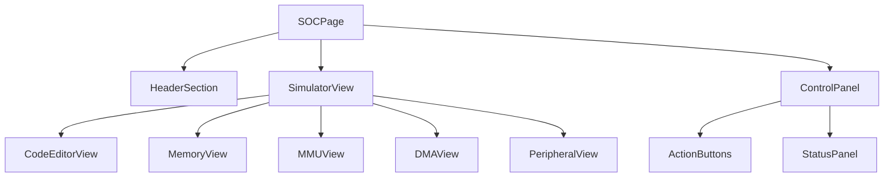

# SOC Page Refactor Plan

## Current Issues Analysis

1. **Monolithic Component**
   - Over 1000 lines in a single file
   - Mixes UI, state management, and business logic
   - Difficult to maintain and test

2. **State Management Complexity**
   - Multiple useState hooks (15+ state variables)
   - State spread across different sections
   - No clear state organization pattern

3. **Performance Concerns**
   - Multiple useEffect hooks with complex dependencies
   - Potential unnecessary re-renders
   - Large component tree

4. **Code Organization**
   - Mixed concerns (UI, logic, event handling)
   - No clear separation of components
   - Some duplicate code patterns

## Proposed Refactoring Solutions

### 1. Component Splitting

Break down into smaller, focused components:

### 2. State Management Improvement

- Create custom hooks for logical groupings:
  - `useSimulatorState` - Core simulator state
  - `useCodeEditor` - Code editor functionality
  - `useMemoryManagement` - Memory/TLB operations
  - `usePeripherals` - Keyboard/LED controls

- Consider Zustand or Context API for shared state

### 3. Performance Optimizations

- Memoize expensive computations
- Use useCallback for event handlers
- Optimize re-renders with React.memo
- Lazy load non-critical components

### 4. Code Organization Improvements

- Create dedicated directories:
  - `components/SOC/` - All SOC-related components
  - `hooks/useSOC/` - Custom hooks
  - `utils/soc/` - Helper functions

- Extract constants and configs

## Implementation Steps

### Phase 1: Component Extraction

1. Create new component files:
   - `SOCHeader.tsx`
   - `SimulatorView.tsx`
   - `ControlPanel.tsx`
   - `CodeEditorSection.tsx`
   - `MemorySection.tsx`
   - `DMASection.tsx`

2. Move related JSX and logic to new components

3. Set up proper props interfaces

### Phase 2: State Management

1. Create custom hooks for logical groupings
2. Set up shared state context
3. Migrate state from useState to new system

### Phase 3: Performance Pass

1. Identify expensive operations
2. Add memoization where needed
3. Optimize effect dependencies
4. Implement lazy loading

### Phase 4: Testing and Validation

1. Add unit tests for new components
2. Verify all functionality works
3. Check performance metrics

## Benefits

1. **Improved Maintainability**
   - Clear component boundaries
   - Better separation of concerns
   - Easier to make changes

2. **Better Performance**
   - Reduced re-renders
   - More efficient updates
   - Smoother user experience

3. **Enhanced Testability**
   - Isolated components easier to test
   - Clearer interfaces
   - Better coverage

4. **Future Extensibility**
   - Easier to add new features
   - Clear patterns for modification
   - Better documentation through structure
